# RepoNote

<div align="center">


**Modern Document Management for the Microservices Era**

[](https://opensource.org/licenses/MIT)
[](https://github.com/Yigtwxx/RepoNote)
[](https://www.docker.com/)
[](https://github.com/Yigtwxx/RepoNote)

</div>

---

## 🚀 Overview

**RepoNote** is a scalable, full-stack document management platform engineered with a robust **microservices architecture**. It goes beyond simple file storage by offering advanced version control, real-time collaboration, and secure access management. Designed for performance and maintainability, RepoNote separates core concerns into distinct, independently deployable services.

Whether deployed locally via Docker Compose or in the cloud on Hugging Face Spaces, RepoNote provides a seamless experience for managing your critical documents.

## ✨ Key Features

*   **🧩 Microservices Architecture**: A fully modular design comprising 5 independent services (Auth, Document, Versioning, Comment, Storage) for maximum scalability and fault isolation.
*   **🔒 Enterprise-Grade Security**:
    *   **JWT Authentication**: Secure, stateless user sessions globally.
    *   **Argon2 Hashing**: Industry-standard password protection.
    *   **Private Storage**: All files are stored in private MinIO buckets, accessible only via signed requests.
*   **⏱️ Version Control**: Never lose work. Track document history automatically, view previous versions, and revert changes with a Git-like experience.
*   **💬 Real-Time Collaboration**: Context-aware commenting system allows teams to discuss documents directly within the interface.
*   **☁️ Hybrid Storage**: Utilizes **MinIO** for high-performance object storage (S3 compatible) and **PostgreSQL** for structured relational data.
*   **🐳 Docker Native**: Built from the ground up to run in containers, ensuring consistency across development and production environments.

## 🏗️ Architecture

RepoNote follows a modern microservices pattern proxied by Nginx.

```mermaid
graph TD
    Client["Client (React SPA)"] -->|HTTP/REST| Gateway["Nginx Gateway"]
    
    subgraph "Microservices Layer"
        Gateway -->|/api/auth| AuthService["🔐 Auth Service"]
        Gateway -->|/api/document| DocService["📄 Document Service"]
        Gateway -->|/api/versioning| VerService["⏱️ Versioning Service"]
        Gateway -->|/api/comment| CommentService["💬 Comment Service"]
        Gateway -->|/api/storage| StorageService["📦 Storage Service"]
    end

    subgraph "Data Layer"
        AuthService --> Postgres[("PostgreSQL")]
        DocService --> Postgres
        VerService --> Postgres
        CommentService --> Postgres
        
        StorageService --> MinIO[("MinIO Object Storage")]
        VerService -.->|Metadata| MinIO
    end
```



## 🛠️ Tech Stack

### Frontend
*   **Framework**: [React 19](https://react.dev/)
*   **Build Tool**: [Vite](https://vitejs.dev/) - Lightning fast HMR.
*   **Styling**: [TailwindCSS v4](https://tailwindcss.com/) & [Framer Motion](https://www.framer.com/motion/) for fluid animations.
*   **Networking**: Axios with interceptors for seamless JWT handling.
*   **Icons**: Lucide React.

### Backend Services
All microservices are built with **Python 3.10+** and **FastAPI**, chosen for their speed and async capabilities.

| Service | Port | Description |
| :--- | :--- | :--- |
| **Auth** | `:8001` | User registration, login, and JWT token issuance. |
| **Document** | `:8002` | CRUD operations for document metadata and ownership. |
| **Versioning** | `:8003` | Manages document history and file snapshots. |
| **Comment** | `:8004` | Handles user discussions attached to documents. |
| **Storage** | `:8005` | Interfaces with MinIO for physical file I/O. |

### Infrastructure
*   **Database**: PostgreSQL 15 (Alpine)
*   **Object Storage**: MinIO (S3 Compatible)
*   **Containerization**: Docker & Docker Compose
*   **Gateway**: Nginx (Reverse Proxy & Static File Serving)

## 📦 Installation & Setup

### Option 1: Local Development (Recommended)

Run the entire stack locally with a single command.

1.  **Clone the repository**
    ```bash
    git clone https://github.com/Yigtwxx/RepoNote.git
    cd RepoNote
    ```

2.  **Start the Application**
    Ensure Docker Desktop is running.
    ```bash
    docker-compose up --build
    ```
    *This will build all 5 microservices, the frontend, and spin up Postgres and MinIO.*

3.  **Access RepoNote**
    *   **Frontend**: Open [http://localhost:3000](http://localhost:3000)
    *   **MinIO Console**: [http://localhost:9001](http://localhost:9001) (User/Pass: `minioadmin`)

### Option 2: Hugging Face Spaces

This repository includes a specialized `Dockerfile.hf` and `start_hf.sh` script designed to deploy the entire stack as a **single container** on Hugging Face Spaces.

1.  Create a new Space (Docker SDK).
2.  Push this code to your Space.
3.  The `start_hf.sh` script handles internal port forwarding and process management automatically.

## 📖 API Documentation

Each microservice comes with interactive Swagger UI documentation. When running locally:

*   **Auth API**: [http://localhost:8001/docs](http://localhost:8001/docs)
*   **Document API**: [http://localhost:8002/docs](http://localhost:8002/docs)
*   **Versioning API**: [http://localhost:8003/docs](http://localhost:8003/docs)
*   **Comment API**: [http://localhost:8004/docs](http://localhost:8004/docs)
*   **Storage API**: [http://localhost:8005/docs](http://localhost:8005/docs)

## 🤝 Contributing

Contributions are welcome! Please follow these steps:

1.  Fork the project.
2.  Create your feature branch (`git checkout -b feature/AmazingFeature`).
3.  Commit your changes (`git commit -m 'Add some AmazingFeature'`).
4.  Push to the branch (`git push origin feature/AmazingFeature`).
5.  Open a Pull Request.

## 📝 License

Distributed under the MIT License. See `LICENSE` for more information.

---

<div align="center">

**Developed by [Yiğit Erdoğan](https://www.linkedin.com/in/yiğit-erdoğan-ba7a64294)**

</div>
